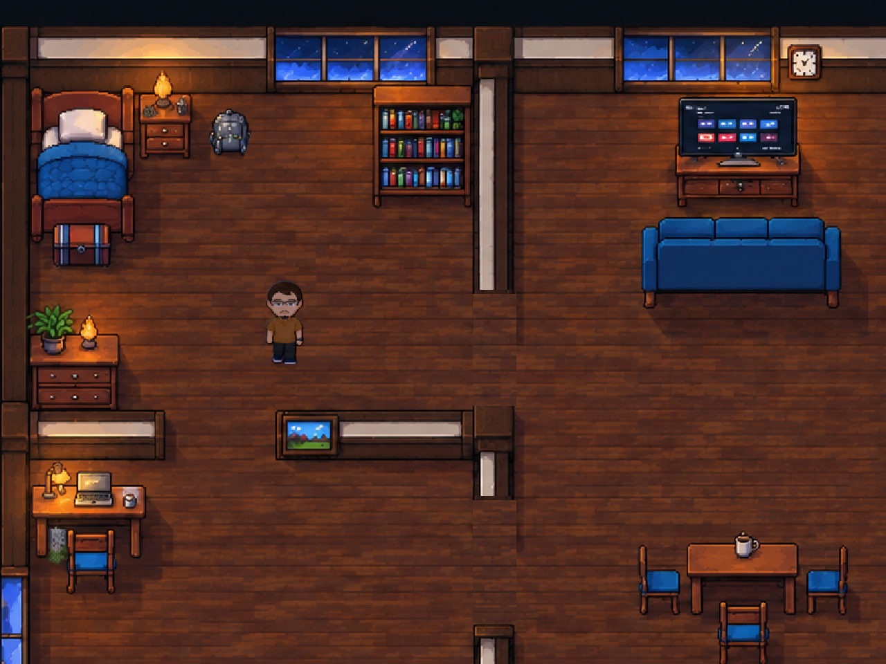

# Iluminação dos personagens — 07/10/2026

Mantém a arte, proporções, animações, pivôs, ordenação e Collider2D dos personagens. Usa o sistema Built-in existente; não migra mapas para Tilemaps nem converte a pipeline.

## O que mudou

- Personagens recebem a cor ambiente e a luz das lâmpadas já descritas nos mapas ilustrados. Paredes do mapa separam a contribuição das lâmpadas entre cômodos.
- A lanterna equipada ilumina também os sprites dentro de seu feixe. Reutiliza o feixe que já respeita paredes e móveis; não calcula um segundo cone incompatível.
- Os dois faróis acompanham a posição, orientação e ativação do Fusca e contribuem na iluminação dos personagens. Colisores de cenário e paredes bloqueiam essa contribuição.
- Cor, volume discreto e sombras usam a mesma fonte predominante. Atualizam em cada quadro, acompanhando luzes em movimento. O volume usa as dimensões do sprite em coordenadas do mundo, sem depender da posição do frame no atlas.
- Um material compartilhado e parâmetros por personagem preservam o filtro de pontos e evitam criar um material por animação. Não foram gerados novos sprites ou normal maps.
- A descoberta de personagens continua depois dos primeiros seis segundos. Visuais de sombra/contato não são descobertos como personagens.

## Capturas reais no Unity

Mesma cena e posição, renderizadas pela câmera do jogo em 1280×960. A primeira mostra a iluminação ambiente desta revisão; a segunda acrescenta uma fonte móvel de teste para tornar visível a resposta do personagem. **Não são uma comparação de versões antigas nem um redesenho gerado por IA.** A fonte de teste não é instalada no jogo.

| Ambiente | Com fonte dinâmica de teste |
| --- | --- |
|  |  |

## Verificação

Os testes verificam contribuição de luz por posição/direção, alcance e bordas do cone, bloqueio por paredes, exclusão dos visuais de sombra, descoberta tardia, conservação da textura e do Collider2D, ativação dos faróis e iluminação por uma lanterna realmente equipada. As evidências e contagens finais constam no [relatório da campanha](../CampanhaOficial/RELATORIO_15_FASES_20261007.md).

As sombras são projeções 2D e contato com o chão; este sistema não reconstrói em 3D os objetos pintados nos mapas. As luzes já pintadas nas imagens permanecem. Não foi medida a taxa de quadros em hardware de jogadores; a revisão visual humana de todos os mapas permanece pendente.

## Referências mostradas antes da implementação

- [Unity: iluminação 2D e detalhe de superfícies](https://docs.unity.com/en-us/engine/6000.6/manual/unity2d/2d-urp/2d-index). Referência de luz, sombra e volume; a implementação foi adaptada ao Built-in existente.
- [Unity: MaterialPropertyBlock](https://docs.unity3d.com/ScriptReference/MaterialPropertyBlock.html). Parâmetros por personagem em material compartilhado.
