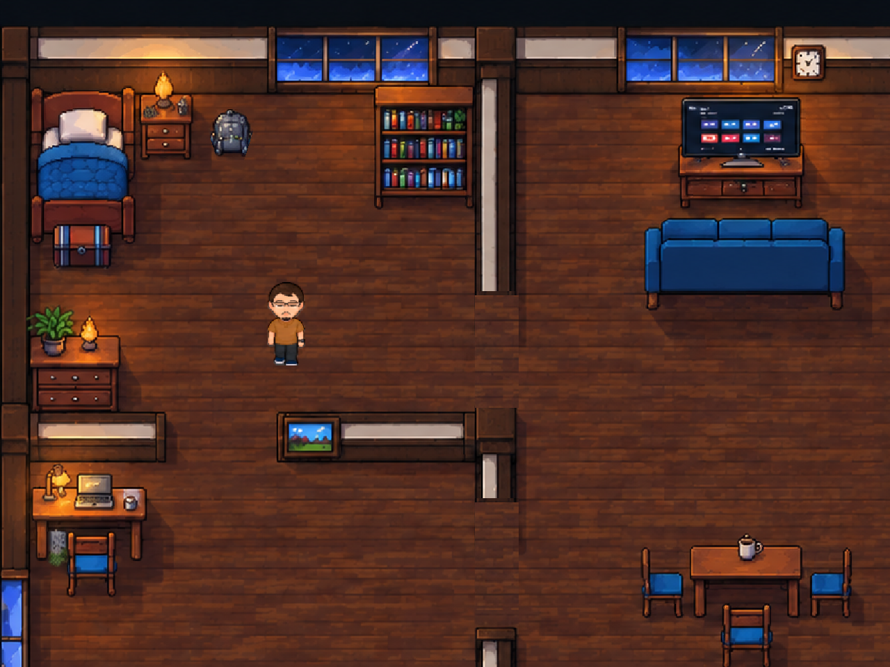

# O Segredo de Varginha

**Uma investigação sobrenatural em pixel art, vista de cima, ambientada em Varginha.**

Trinta anos depois de uma noite esquecida, Edelzio encontra uma caixa que devolve perguntas sobre seu passado. Explore casas, a Escola Industrial, trilhas e laboratórios; converse com Renan, Padre Fábio e Ouzana; reúna pistas e conte com seus aliados quando a investigação se transformar em combate.

**Em desenvolvimento · 15 fases em 5 atos · atualização: 07/10/2026.**

[Site oficial](https://o-segredo-de-varginha.zfabiobrronaldo.chatgpt.site) · [Como começar](#como-começar) · [Controles](#controles) · [Ajuda para puzzles](#ajuda-para-puzzles) · [Reportar um problema](https://github.com/fwbiodev7/segredo-varginha-game-teste-cutscene-gdd-ldd/issues)



## Posso jogar agora?

A campanha está implementada no projeto Unity deste repositório. **Ainda não há um executável público para download nem uma versão jogável no site.** O site apresenta o jogo, personagens, imagens e novidades. Para jogar esta versão, abra o projeto no Unity e use o modo Play.

O projeto foi validado com **Unity 6000.6.0f1 no Windows**. Ainda não há requisitos mínimos de hardware medidos, duração oficial da campanha ou suporte certificado para outras plataformas.

## Como começar

1. Instale o Unity Hub e o Editor **6000.6.0f1**.
2. Baixe pelo botão **Code → Download ZIP** e extraia a pasta, ou clone este repositório com Git. Para testar uma atualização em outra branch, selecione essa branch antes de baixar.
3. No Unity Hub, escolha **Add / Adicionar projeto do disco** e selecione a pasta que contém `Assets`, `Packages` e `ProjectSettings`.
4. Abra o projeto e aguarde a importação. Na primeira abertura, o Unity pode baixar as dependências; mantenha acesso à internet.
5. Abra [Assets/Scenes/Menu_MisterioDeVarginha.unity](Assets/Scenes/Menu_MisterioDeVarginha.unity).
6. Pressione **Play** no Editor. No jogo, escolha **Jogar → Iniciar campanha**. Para retomar, escolha **Jogar → Continuar**.

**Iniciar campanha substitui o progresso salvo.** Use Continuar para preservar sua investigação. Pare o modo Play pelo mesmo botão do Editor quando terminar.

Comece pelo menu para configurar corretamente os sistemas. Cenas com nomes antigos e o laboratório de experimentos continuam no projeto; a ordem válida da campanha é a apresentada pelo menu.

## O que você faz no jogo

- **Investiga:** aproxima-se de objetos e pessoas, lê documentos e compara pistas.
- **Registra:** consulta no caderno as evidências encontradas, inclusive em fases anteriores.
- **Resolve:** interpreta fotografias, símbolos, páginas e equipamentos, com dicas opcionais.
- **Explora:** atravessa áreas conectadas e usa o Fusca nos momentos previstos pela história.
- **Combate:** encadeia golpes, esquiva de ataques sinalizados e usa alunos e apoios com recargas próprias.

A infância começa sem combate. Conversas e documentos adicionais ampliam a história. Rotinas domésticas, inspeções repetidas da viagem e uma pista de teste da oficina deixaram de ser obrigatórias. Os close-ups da caixa e da fotografia esperam você confirmar **Continuar**.

Os mapas ilustrados e personagens atuais mantêm sua identidade. A luz local ajusta as cores e o volume dos sprites; lanterna e faróis participam da iluminação, e as sombras acompanham a fonte predominante. A arte continua com filtro de pontos.

## Controles

Estes são os controles padrão. Os comandos de movimento, interação e combate podem ser remapeados em **Configurações → Controles → Remapear teclado e mouse**. A escolha fica salva entre as cenas.

| Ação | Teclado / mouse |
| --- | --- |
| Mover | WASD ou setas |
| Correr | Shift esquerdo |
| Examinar / conversar | E; Espaço e Enter também são aceitos nas interações correspondentes |
| Caderno de pistas | Tab |
| Mochila / equipamentos | G |
| Dicas graduais, a partir da fase 2 | F1 ou **Preciso de uma dica** no caderno |
| Pausar / voltar | Esc |
| Atacar / encadear combo | Mouse esquerdo ou J |
| Comandar aluno | Mouse direito ou L |
| Comandar apoio / professor | H |
| Esquivar | Ctrl esquerdo |
| Pular, quando disponível | K |
| Alternar lanterna equipada | V |
| Usar os três alunos equipados na batalha da campanha | 1, 2 e 3 |

Clique nos botões dos puzzles para selecionar ou trocar elementos e confirmar. Ações e equipamentos ficam disponíveis conforme a campanha. Os números dos alunos na batalha têm função própria; diferem da seleção de itens dos protótipos antigos.

**No combate:** mantenha o ataque pressionado para encadear os socos, acompanhe os avisos no chão e saia da área antes do golpe. Na mochila, equipe três alunos e um apoio. Use as habilidades quando estiverem prontas; paredes, alcance e recarga influenciam o comando. A interface informa as ações disponíveis.

## Configurações e acessibilidade

Abra **Configurações** no menu principal ou pela pausa durante a campanha.

| Opção | Para que serve |
| --- | --- |
| Fácil / Médio / Difícil | Ajusta fases com combate; a abertura continua sem combate |
| Legendas e tamanho | Ativa legendas e escolhe tamanho pequeno, médio ou grande |
| Reduzir distorções e clarão | Reduz efeitos e adapta os trechos cinematográficos que usam essa opção |
| Indicações de interação | Mostra ou oculta as indicações dos pontos investigáveis |
| Áudio | Ajusta volume geral, música/ambiência, efeitos e vozes |
| Vídeo | Resoluções 960×540, 1280×720, 1600×900 e 1920×1080; janela, janela sem bordas ou tela cheia |
| Sincronização vertical / limite de quadros | Ajusta VSync e limite de 60 ou 120 FPS |

Após mudar resolução ou modo de janela, use **Aplicar exibição**. No modo Play do Editor, o painel Game também controla o tamanho da visualização. Informe problemas de leitura ou controle nas Issues.

## A campanha, sem revelar as soluções

| Ato | Fases exibidas | Tema |
| --- | --- | --- |
| I — A Lembrança Volta | 1–3 | Infância, a caixa esquecida e pistas na Escola Industrial |
| II — O Caminho da Capela | 4–6 | Fragmentos, trilhas e registros históricos |
| III — Evidências que Mudam | 7–9 | Ouzana, reagentes e investigação de áreas conectadas |
| IV — A Noite Esquecida | 10–12 | Memórias, arquivos e preparação dos equipamentos |
| V — O Verdadeiro Segredo | 13–15 | Descobertas, confronto e desfecho |

A campanha tem um desfecho principal. Estes são os números apresentados ao jogador. Nomes de cenas e IDs antigos foram preservados para compatibilidade; áreas da oficina e do casarão não acrescentam capítulos à contagem de 15.

## Ajuda para puzzles

Consulte primeiro o caderno com **Tab**. A partir da fase 2, use **F1** ou **Preciso de uma dica**. Cada puzzle oferece três níveis: orientação, local e solução. Avance apenas até a ajuda que deseja; abrir uma dica não resolve o puzzle nem altera o progresso.

Para um passo a passo, abra o [guia completo de puzzles das 15 fases](Docs/CampanhaOficial/GUIA_COMPLETO_PUZZLES.md). **Contém spoilers, respostas e detalhes do final.** O guia usa a numeração atual e inclui equipe, reguladores, combate e retorno.

## Salvamento e retomada

O jogo salva localmente o progresso nos pontos previstos pelas interações e transições. **Continuar** só fica disponível quando existe um save neste computador. Não há sincronização em nuvem.

Saves antigos migram uma vez para o formato atual, preservando equipamentos, fragmentos, documentos e etapas concluídas. Fases incorporadas a outras retomam na fase correspondente. Vitórias e etapas do desfecho também são preservadas; abrir a passagem exige cumprir os requisitos do final.

Para fazer uma cópia de segurança, procure `CampaignStory2026.json` na pasta de dados persistentes do Unity. No Windows, normalmente fica em `%USERPROFILE%\AppData\LocalLow\<Empresa>\<Produto>`; os nomes são definidos em **Project Settings → Player**. Feche o jogo antes de copiar o arquivo. Ajustes e controles são guardados separadamente nas preferências do Unity.

## Dúvidas frequentes

**O site abre o jogo?** Nesta versão, o site é a apresentação pública. A campanha roda pelo projeto Unity.

**Continuar está desativado?** Ele depende de um save existente. Comece uma campanha e avance pela investigação.

**Uma ação não funciona?** Confira o comando em Configurações, aproxime-se do objeto, feche o painel atual e verifique o equipamento. No combate, confira alcance e recarga. Consulte o caderno e as dicas se faltar uma pista.

**A lanterna não acende?** Ela precisa estar adquirida e equipada na barra de itens. Depois use V. Paredes e móveis podem bloquear o feixe.

**A imagem parece pequena ou borrada?** Confira a resolução e o tamanho do painel Game no Editor. Evite avaliar a nitidez apenas pela miniatura de uma captura; a arte usa filtro de pontos.

**Como reportar um erro?** Abra uma [Issue](https://github.com/fwbiodev7/segredo-varginha-game-teste-cutscene-gdd-ldd/issues) com a fase exibida, objetivo atual, passos para reproduzir, resultado esperado, versão do Unity e uma captura ou mensagem de erro. Informe a branch se estiver testando uma atualização. Retire informações pessoais antes de anexar logs.

## Para quem desenvolve

Este é o repositório experimental [segredo-varginha-game-teste-cutscene-gdd-ldd](https://github.com/fwbiodev7/segredo-varginha-game-teste-cutscene-gdd-ldd), iniciado a partir do [protótipo principal](https://github.com/fwbiodev7/misterio_de_varginha-jogofeiratecnica-2026-prot-tipo_principal). Alterações desta cópia não são enviadas automaticamente ao projeto principal.

- Use **Unity 6000.6.0f1** e as dependências de [Packages/manifest.json](Packages/manifest.json).
- A renderização validada é **Built-in**, com materiais específicos para personagens. A presença do pacote URP não significa que o projeto use essa pipeline.
- A sequência fica em [CampaignSequence.cs](Assets/Scripts/Game/Varginha/Experiment/CampaignSequence.cs). Preserve os IDs internos ao alterar a ordem.
- Abra **Window → General → Test Runner** e execute Edit Mode e Play Mode. Consulte o [relatório desta revisão](Docs/CampanhaOficial/RELATORIO_15_FASES_20261007.md).
- Para gerar uma distribuição, confira as cenas habilitadas em **File → Build Profiles** e teste a plataforma escolhida. Esta revisão não produz um executável.
- O laboratório antigo fica em **Varginha → Experimentos → Abrir laboratório**. `Preview/` contém materiais auxiliares; a campanha é o projeto Unity.

```text
Assets/Scenes/                    Cenas e menu
Assets/Scripts/Game/Varginha/     Personagens, controles e sistemas
Assets/Scripts/Game/Varginha/Experiment/  Campanha e iluminação
Assets/Resources/Varginha/        Mapas, sprites e shaders
Assets/Tests/                     Testes Edit Mode e Play Mode
Docs/CampanhaOficial/             Guia, sequência e evidências
Docs/                            Design e histórico
Packages/                        Dependências Unity
ProjectSettings/                 Configuração do projeto
```

## Documentação e estado da revisão

- [Sequência atual e compatibilidade dos saves](Docs/CampanhaOficial/CAMPANHA_15_FASES.md) — inclui detalhes narrativos.
- [Guia completo de puzzles](Docs/CampanhaOficial/GUIA_COMPLETO_PUZZLES.md) — contém spoilers.
- [Iluminação e capturas no Unity](Docs/QAIluminacao20261007/README.md).
- [Relatório de validação](Docs/CampanhaOficial/RELATORIO_15_FASES_20261007.md) e [evidências dos testes](Docs/CampanhaOficial/EVIDENCIAS_15_FASES_20261007.json).
- [Referências pesquisadas e melhorias](Docs/CampanhaOficial/REFERENCIAS_E_MELHORIAS_20261007.md).
- [GDD](Docs/GDD.md), [arquitetura](Docs/ARCHITECTURE.md) e [histórico de alterações](Docs/CHANGELOG.md).
- [Arte e animações de Edelzio](Docs/EdelzioV3.md).

Documentos antigos de 20/21 fases continuam como histórico. A sequência atual é de **15 fases em 5 atos**. Os testes automatizados verificam sistemas e percursos específicos; ainda faltam uma sessão manual completa, revisão visual em diferentes telas e avaliação de jogadores. O relatório informa a cobertura e os limites.

## Arte e créditos

Os mapas ilustrados foram gerados com GPT e integrados ao projeto. Esta revisão preserva a composição dos mapas e a identidade dos personagens, ajustando a resposta dos sprites à iluminação. Referências e detalhes de arte estão nos documentos do projeto e na apresentação pública. A fonte do site usa a [licença SIL Open Font License](Website/dist/assets/FONT-LICENSE.txt).
